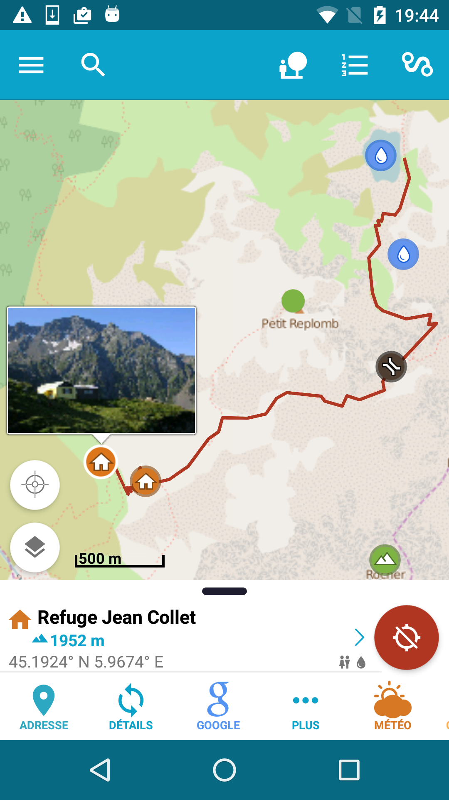

</a>

<h1 align="center">You hiking companion</h1>

EnRecipes is an open source, privacy-friendly digital cookbook that lets you create, manage and share your recipes.

 

 You can get the <a href="https://github.com/farfromrefug/alpimaps/releases/latest">latest release on GitHub</a>

<h2 align="center">Enjoying AlpiMaps?</h2>

Please consider making a small donation to help fund the project. Developing an application, especially one that is open source and completely free, takes a lot of time and effort.
 
 

[:heart: Sponsor](https://github.com/sponsors/farfromrefug)

Alpi Maps is a map application to help you prepare and enjoy your hike!
Get all the info you need before you go, then enjoy all the data offline during your hike.

Alpi Maps also helps you in managing the GPS to get your precise location when needed while keeping the battery consumption to the lowest.
Continued use of GPS running in the background can dramatically decrease battery life.

Alpi Maps data is base on OpenStreetMap, which means you can access almost anything anywhere in the world!

## Map features:
• enjoy more that 50 different map styles
• enjoy more that 20 different map overlay styles like ski trails
• enable / disable HD map for each style
• combine map styles with opacity to create your own map
• enjoy Google Maps style, traffic layers and buildings
• enjoy rotating and tilting map
• use the Google Maps gestures you love so much like the double tap and drag to zoom!

## GPS features:
• follow your location on the map
• choose wether to follow your location or only query your location when needed for the lowest battery consumption
• choose the accuracy of the GPS for even lower battery consumption
• access useful information about your position like altitude, orientation, sunset, sunrise...
• track your position on any computed itinerary to see where you are at
• see where you are from any point on the map : distance, orientation and altitude
• decide wether you want the app to track you while in background or not
• share your location with a screenshot of the map

## Markers features:
• add a marker from any point on the map
• find geo features around you  (visible map view) to prepare your hike
• get details informations for map points like description, opening hours, photos, facebook, phones ... (coming from OpenStreetMap and Facebook)
• find the altitude of any point on the map
• query the adress
• fast search any marker on Google
• customise your markers with icon, name and color for ease of use
• manage your markers in lists for offline storage
• seeing an amazing scenery? easily create a marker at your location by taking a photo

## Offline features:
• everything map you see is cached. Prepare your hike in advance, look where you are going and access your maps offline while hiking.
• every single marker and all its details are available offline
• offline itinerary profile
• use your phone airplane mode to make sure you don't sure too much battery (network search can drain your battery), and still access your data. 

## Search features:
• Alpi Maps use the OpenStreetMap database for its search module. Access all geo features, all businesses, cities and much more!
• search for Panoramia images around you!
• search for business / refuge ... around a map point
• use the search as you type feature to quickly look for something in your markers or anywhere in the world
• then use the search to look for businesses, restaurants, ... in the region you are currently seeing

## Screenshots

|  |  |  |

### Having issues, suggestions and feedback?

You can,
- [Create an issue here](https://github.com/farfromrefug/alpimaps/issues)