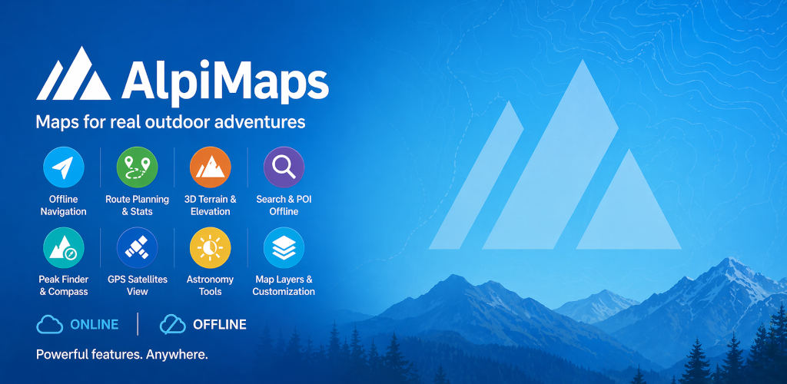
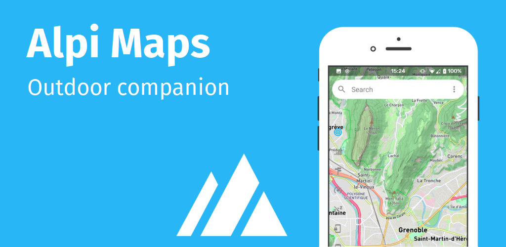

<!-- <p align="center"></a></p> -->

<!--  -->


<!-- # OSS Document Scanner -->

[](COC.md)
[](https://github.com/Akylas/alpimaps/stargazers)
[](https://github.com/Akylas/alpimaps/blob/master/COPYING)
[](https://github.com/Akylas/alpimaps/releases/)
[](https://github.com/Akylas/alpimaps/releases/latest)
[](https://hosted.weblate.org/engage/alpimaps/?utm_source=widget)

<!-- <h1 align="center">Scan all your documents</h1>
<p align="center">
  <a href="https://github.com/Akylas/alpimaps" alt="License"></a>
 <a href="https://github.com/Akylas/alpimaps/releases" alt="Release version"></a> -->

 ## Installation

<!-- [](https://f-droid.org/packages/com.machiav3lli.backup/) -->
[](https://apt.izzysoft.de/packages/akylas.alpi.maps)
[](https://play.google.com/store/apps/details?id=akylas.alpi.maps)
[](https://github.com/Akylas/alpimaps/releases)
<div>

#### AppVerifier hashes 
**AlpiMaps**: 
```
akylas.alpi.maps
39:EA:68:80:92:09:BA:74:AF:24:F0:8E:DE:D1:CB:79:D7:BE:B6:9D:47:3D:99:FF:DF:1A:51:54:0F:A3:54:72
```
<!-- <a href="https://apps.apple.com/us/app/alpimaps/id6472918564"></a>
</div> -->
 
<!-- <p align="center">
<br>You can get the <a href="https://github.com/akylas.alpi.maps/releases/latest">latest release on GitHub</a>
</p>
<div align="center">
<a href="https://apt.izzysoft.de/packages/akylas.alpi.maps/"></a>
<a href='https://play.google.com/store/apps/details?id=akylas.alpi.maps&pcampaignid=pcampaignidMKT-Other-global-all-co-prtnr-py-PartBadge-Mar2515-1'></a>
<br>
<a href="https://testflight.apple.com/join/sxiV4ZKL"></a>
</div>
</div> -->
<h2 align="center">Enjoying Alpi Maps?</h2>
<p align="center">Please consider making a small donation to help fund the project. Developing an application, especially one that is open source and completely free, takes a lot of time and effort.
<br>
<br>
<div align="center">
<a href="https://github.com/sponsors/farfromrefug">:heart: Sponsor</a>
</div>
<hr>


Alpi Maps is a map application to help you prepare and enjoy your hike!
Get all the info you need before you go, then enjoy all the data offline during your hike.

Alpi Maps also helps you in managing the GPS to get your precise location when needed while keeping the battery consumption to the lowest.
Continued use of GPS running in the background can dramatically decrease battery life.

Alpi Maps data is base on OpenStreetMap, which means you can access almost anything anywhere in the world!

## Map features:

* enjoy more that 50 different map styles
* enjoy more that 20 different map overlay styles like ski trails
* enable / disable HD map for each style
* combine map styles with opacity to create your own map
* enjoy rotating and tilting map
* use the Google Maps gestures you love so much like the double tap and drag to zoom!
* query weather data for any point on the map( requires [OSS Weather](https://github.com/Akylas/oss-weather) to be installed)

## Default Vector AmericanOSM map

AlpiMaps uses [AmericanaOSM](https://tile.ourmap.us) as a default Vector data source. At first Alpimaps was providing a free instance for all to share.
However i quickly got over the limit so i had to close it.
So now instead i share how to create your own free instance and use it in the app. For that you need to create a AWS account and setup an instance.
It is very easy, follow this [tutorial](https://docs.protomaps.com/deploy/aws#_2-cloudformation-template), only the `CloudFormation Template` section is needed. **One important thing not there is that the `BucketName` is `osmus-tile` and you must make sure your stack is created in the `us-east-2` region**. Only the `CloudFormation Template` section is needed.
To make sure the region is correct. Once the stack is created you can check the `LambdaFunctionUrl` in the stack `Resources` section. It should start with `arn:aws:lambda:us-east-2`.
Once you've set it up you'll end up with a `https://SUBDOMAIN.cloudfront.net` URL in the "Outputs" section of the created stack. Now go into AlpiMaps Settings/ApiKeys and set that URL for `americanaosm`.
Then you can add the AmericanaOSM data source and it will be using your own instance.

### Tip
When setting up your AWS account, if the account creation force you to setup a credit card, don't be scared:
* it is your instance, nor i nor anyone else won't have access to it. So you dont risk much
* setup alert on tier limit (how i discovered mine was quickly growing) following this [guide](https://docs.aws.amazon.com/awsaccountbilling/latest/aboutv2/tracking-free-tier-usage.html)

## Offline Maps

*AlpiMaps* was created to be used with offline data so that you get access to everything offline.
On Android that data is expected to be found on the SDCard under `alpimaps_mbtiles`.
All the data can be generated using [alpimaps_data_generator](https://github.com/Akylas/alpimaps_data_generator). But theoretically you should be able to use mbtiles acquired through other sources
Here is an example of how it can look like

* Top level data are for world mapping. The idea is to be able to render the whole world at low zoom levels. `routes` stands for hiking/cycling routes. So you can get main hiking/cycling roads worldwide.
* each subfolder represents a zone/country:
   - france_full.mbtiles: the whole france map. Equivalent to osm maps with a few changes (removed a few things and added others). All centered around hiking/cycling
   - etiles files: elevation/hillshade data. Gives you hillshading, slope percentages, elevation profiles and any point elevation
   - *contours*.mbtiles: give you elevation contour lines
   - *routes*.mbtiles: give you hiking/cycling routes at all levels
   - vtiles files: give you full routing queries with direction instructions for car/pedestrian,cycling... It also can give you surface stats like komoot does
   - nutigeodb files: gives you geocoding/reverse geocoding. You can search for a lot of things offline. This one i am not 100% happy with yet.

If you use those data, they will automatically be loaded on start and enable a ton of offline features:
* full offline vector maps with OSM / Outdoor styles
* query and point/line/polygon on the map 
* access elevation from any point of the map
* compute routing for cycling/car/pedestrian
* compute elevation profile for any route
* compute stats profile for any route like komoot does
* hillshade / slopes rendering
* geocoding
* render vector routes for hiking/cycling

## GPS features:

* follow your location on the map
* choose wether to follow your location or only query your location when needed for the lowest battery consumption
* choose the accuracy of the GPS for even lower battery consumption
* access useful information about your position like altitude, orientation, sunset, sunrise...
* track your position on any computed itinerary to see where you are at
* see where you are from any point on the map : distance, orientation and altitude
* decide wether you want the app to track you while in background or not
* share your location with a screenshot of the map

## Markers features:

* add a marker from any point on the map
* query the adress
* manage your markers in lists for offline storage

## Search features:

* Alpi Maps use the OpenStreetMap database for its search module. Access all geo features, all businesses, cities and much more!
* use the search as you type feature to quickly look for something in your markers or anywhere in the world
* then use the search to look for businesses, restaurants, ... in the region you are currently seeing

## tools

* Compass tool allowing to find the direction to any point on the map.
* satellites viewer: see which satellites are used to query your GPS location. Useful to understand why you don't have a good signal
* option to show on lock screen: useful when cycling
* option to force full brightness

## Screenshots

|  |  |  |  |  |  |

### Having issues, suggestions and feedback?

You can,
- [Create an issue here](https://github.com/Akylas/OSS-DocumentScanner/issues)

### Languages: [](https://hosted.weblate.org/engage/alpimaps/?utm_source=widget)

[](https://hosted.weblate.org/engage/alpimaps/)

The Translations are hosted by [Weblate.org](https://hosted.weblate.org/engage/alpimaps/).


<p align="center">
  <a href="https://raw.githubusercontent.com/farfromrefug/sponsorkit/main/sponsors.svg">
	
  </a>
</p>

## Building Setup

### Nativescript

First [setup Nativescript](https://docs.nativescript.org/setup/linux)

This project is optimized to be built with [Akylas Fork](https://github.com/Akylas/NativeScript). Though it would work with main it is best to use this fork. The `package.json` defines a resolution to `../NativeScript/dist/packages/core` so clone the fork and build it using `npm run setup:yarn && npm run ui-mobile-base:build && npm run core:build`

### Yarn

You need to use yarn with this project as it uses the `portal:` protocol for some dependencies.
Note that the project has some `yarn link` for easy local dev for me. The best is for you to remove the `resolutions` part of the `package.json`

### dotenv

The app uses `.env` file to set up needed environment variables. `.env` is not commited as it contains sensitive data
Simply create a `.env` file with:
```
source .env.ci
```

Then "source" the file in the terminal so that variable are exported and available to nativescript cli.
I use dotenv plugin for zsh which automatically loads the `.env` file

### Building

Now that all is setup and that you prepared the 3rd party libraries you can actually build and run the app:

* `yarn`
* `ns run android --no-hmr --env.devlog` (replace by `ios` for iOS...)

This should run the app on the first discovered device or emulator.